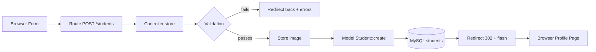
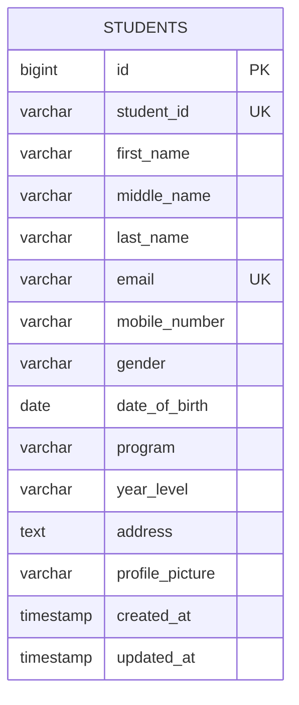
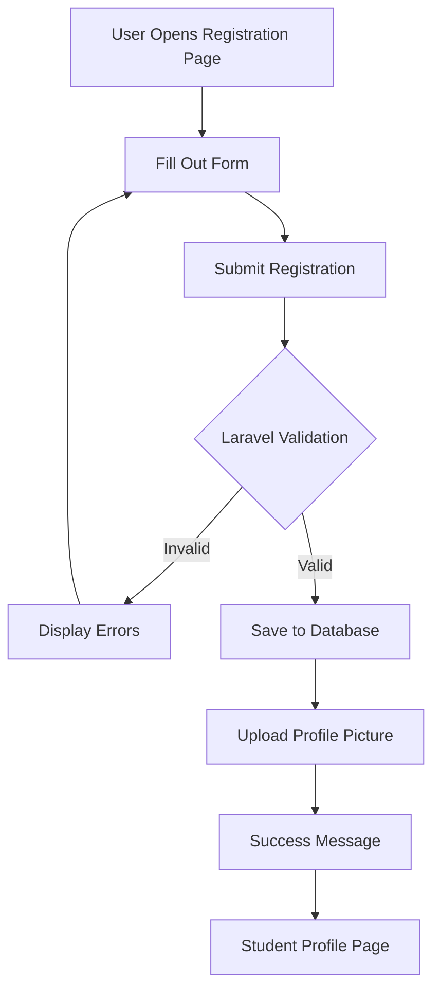

# Student Registration System with Laravel Forms

A complete Laravel web application that replaces paper-based student registration with a digital system. Students can register online, submit personal and academic information, upload a profile picture, and view their registered profile. Built with Laravel, PHP, MySQL, Blade, Laravel Storage, and Tailwind CSS.

**Repository:** `Student-Registration-System-with-Laravel-Forms` (public on GitHub)

---

## Table of Contents

1. [Introduction](#1-introduction)
2. [Objectives](#2-objectives)
3. [Laravel Request Lifecycle](#3-laravel-request-lifecycle)
4. [Validation Rules](#4-validation-rules)
5. [Database Design](#5-database-design)
6. [Flowchart](#6-flowchart)
7. [Screenshots](#7-screenshots)
8. [Problems Encountered](#8-problems-encountered)
9. [Solutions](#9-solutions)
10. [Reflection](#10-reflection)
11. [References](#11-references)
12. [Required Diagrams](#12-required-diagrams)
13. [Git Commit History](#13-git-commit-history)

---

## 1. Introduction

### Purpose of a Student Registration System

Educational institutions need efficient ways to collect and manage student data. Paper-based registration forms are slow, prone to errors, and difficult to search through. A digital Student Registration System solves these problems by allowing students to register online through a web form. The system stores all information in a database, making it easy to retrieve and manage records.

This project demonstrates how to build a registration system using Laravel, a popular PHP framework. Students can fill out a form with their personal details, contact information, academic program, and address. They can also upload a profile picture that gets stored securely on the server.

### Importance of Data Validation

When users submit forms, the data they enter must be checked before saving it to the database. This process is called validation. Without validation, the system could save empty fields, duplicate records, or malicious files.

For example, if a student submits the same email address twice, the system should reject the second submission. If someone tries to upload a virus disguised as an image, the system should block it. Validation protects the integrity of the database and the security of the application.

### Role of Registration Systems in Enterprise Applications

Registration systems are used in many industries:

- **Schools and Universities**: Student enrollment, course registration
- **Hospitals**: Patient intake, appointment booking
- **Companies**: Employee onboarding, customer sign-up
- **Government**: Citizen registration, license applications

The same patterns used in this student registration system apply to all these scenarios. Learning how to build one helps prepare for real-world software development.

---

## 2. Objectives

1. Build a complete registration system using Laravel framework
2. Create a responsive web form with Tailwind CSS
3. Implement server-side validation for all form fields
4. Handle file uploads securely using Laravel Storage
5. Display flash messages for user feedback
6. Design a MySQL database with proper constraints
7. Practice Git version control with meaningful commits
8. Document the project with diagrams and screenshots

---

## 3. Laravel Request Lifecycle

When a student submits the registration form, here is what happens:

```
Browser (form @ /students/create)
  → Route (POST /students → StudentController@store, routes/web.php)
    → Controller (StudentController::store)
      → Validation ($request->validate with all rules)
        → Model (Student::create($validated), app/Models/Student.php)
          → Database (INSERT INTO students, MySQL)
            → Response (redirect()->route('students.show', $student)->with('success'))
              → Browser (302 → GET /students/{id}, show.blade.php with flash banner)
```

**Step-by-step breakdown:**

1. **Browser**: User fills out form at `/students/create` and clicks submit
2. **Route**: Laravel matches `POST /students` to `StudentController::store`
3. **Controller**: Receives the request and calls validation
4. **Validation**: Checks all fields (required, unique, email, image, etc.)
5. **Model**: If valid, `Student::create()` saves to database
6. **Database**: MySQL stores the record in `students` table
7. **Response**: Redirects to profile page with success message
8. **Browser**: Displays student profile with green flash notification



---

## 4. Validation Rules

All rules are defined in `StudentController::store()`.

| Field | Rule | Why Important |
|-------|------|---------------|
| student_id | `required\|unique:students,student_id` | Prevents duplicate student IDs |
| first_name | `required\|string\|max:100` | Ensures name is provided |
| middle_name | `nullable\|string\|max:100` | Optional field |
| last_name | `required\|string\|max:100` | Ensures surname is provided |
| email | `required\|email\|unique:students,email` | Valid email, no duplicates |
| mobile_number | `required\|regex:/^09[0-9]{9}$/` | Philippine format (11 digits, starts with 09) |
| gender | `required` | Must select Male, Female, or Other |
| date_of_birth | `required\|date` | Valid date format |
| program | `required` | Must select BSIT, BSCS, BSIS, or ACT |
| year_level | `required` | Must select 1st-4th Year |
| address | `required\|string` | Complete address needed |
| profile_picture | `required\|image\|mimes:jpg,jpeg,png\|max:2048` | Valid image, max 2MB |

Server-side validation is the final check. Client-side validation can be bypassed, but server rules cannot. Errors display next to each field using `@error` directive and in a summary banner at the top.

---

## 5. Database Design

ERD Image: `documentation/Database ER Diagram.jpg`



**Table Structure:**

| Column | Type | Null | Key |
|--------|------|------|-----|
| id | bigint unsigned | NO | PK |
| student_id | varchar(255) | NO | UNI |
| first_name | varchar(100) | NO | — |
| middle_name | varchar(100) | YES | — |
| last_name | varchar(100) | NO | — |
| email | varchar(255) | NO | UNI |
| mobile_number | varchar(20) | NO | — |
| gender | varchar(20) | NO | — |
| date_of_birth | date | NO | — |
| program | varchar(100) | NO | — |
| year_level | varchar(20) | NO | — |
| address | text | NO | — |
| profile_picture | varchar(255) | NO | — |
| created_at | timestamp | YES | — |
| updated_at | timestamp | YES | — |

**Primary Key:** `id`
**Constraints:** `UNIQUE(student_id)`, `UNIQUE(email)`

---

## 6. Flowchart

Image: `documentation/Registration Flowchart.drawio.png`



---

## 7. Screenshots

All captures saved under `screenshots/`:

| File | Description |
|------|-------------|
| Student Registration.jpg | Registration form with all 5 sections |
| Validation Error.jpg | Error messages when fields are empty |
| Flash success message.jpg | Green success notification |
| student profile.jpg.png | Student profile with picture |

---

## 8. Problems Encountered

1. **OneDrive File Sync Issue** — The project folder was on OneDrive with Files On-Demand enabled. This caused `mkdir()` errors because OneDrive uses reparse points that Laravel cannot handle properly.

2. **SQLite vs MySQL Conflict** — Laravel defaults to SQLite, but the project requires MySQL. Running migrations created tables in the wrong database.

3. **Route Order Problem** — Having `GET /students/{student}` before `GET /students/create` caused Laravel to interpret "create" as a student ID, resulting in a 404 error.

---

## 9. Solutions

1. **OneDrive Issue**: Moved the project to a local folder that is not synced by OneDrive. Created the project in `C:\Users\admin\OneDrive\Desktop\Student Registration System`.

2. **Database Issue**: Changed `.env` to use MySQL:
   ```
   DB_CONNECTION=mysql
   DB_DATABASE=week04_student_registration
   SESSION_DRIVER=file
   CACHE_STORE=file
   ```
   Then ran `php artisan migrate` to create tables in MySQL.

3. **Route Order**: Reordered routes so that `GET /students/create` comes before `GET /students/{student}`. This ensures the "create" route is matched first.

---

## 10. Reflection

Building this Student Registration System taught me how Laravel handles form submissions from start to finish. The most important lesson was understanding that validation must happen on the server, not just in the browser. A user can disable JavaScript or modify the HTML, so client-side checks are never enough.

The validation rules I implemented cover every field in the form. The `unique` rule prevents duplicate student IDs and emails, which is essential for maintaining clean data. The `email` rule ensures users enter a valid email format. The `image|mimes|max:2048` rule for profile pictures prevents users from uploading dangerous files or oversized images that would slow down the system.

File upload handling was another key learning point. Laravel's `store()` method makes it easy to save files, but you need to run `php artisan storage:link` first. Without that command, uploaded images will not display on the profile page. This is a common mistake that beginners make.

The flash message system provides immediate feedback to users. After a successful registration, the green banner confirms that the data was saved. If there are errors, the red banner shows what went wrong. This kind of feedback is important for a good user experience.

Working with Git throughout the project helped me practice version control. Each commit represents a meaningful change, like adding validation, fixing an upload issue, or updating the UI. This makes it easy to track progress and roll back changes if something breaks.

Overall, this project showed me how all the parts of a Laravel application work together. The routes, controllers, models, views, and database each have a specific role. When they are connected properly, you get a working application that can handle real-world registration tasks.

---

## 11. References

Laravel. (2025). *Laravel documentation*. https://laravel.com/docs

PHP Group. (2025). *PHP manual*. https://www.php.net/docs.php

Oracle. (2025). *MySQL 8.0 reference manual*. https://dev.mysql.com/doc/refman/8.0/en/

Tailwind Labs. (2025). *Tailwind CSS documentation*. https://tailwindcss.com/docs

Mozilla Developer Network. (2025). *MDN Web Docs*. https://developer.mozilla.org

---

## 12. Required Diagrams

Save these files in `documentation/` folder:

- `documentation/Registration Flowchart.drawio.png` — Registration process flowchart
- `documentation/Database ER Diagram.jpg` — Entity Relationship Diagram
- `documentation/laravel-request-lifecycle.png` — Request lifecycle diagram

---

## 13. Git Commit History

```
feat: initial Laravel project setup
feat: create student migration
feat: create Student model
feat: create StudentController
feat: add student routes
feat: build registration form and student views
feat: implement validation rules
feat: upload student profile picture
feat: add flash messages
fix: resolve image upload issue
refactor: clean controller methods
style: improve UI with green theme
docs: add screenshots
docs: update README with documentation
```
