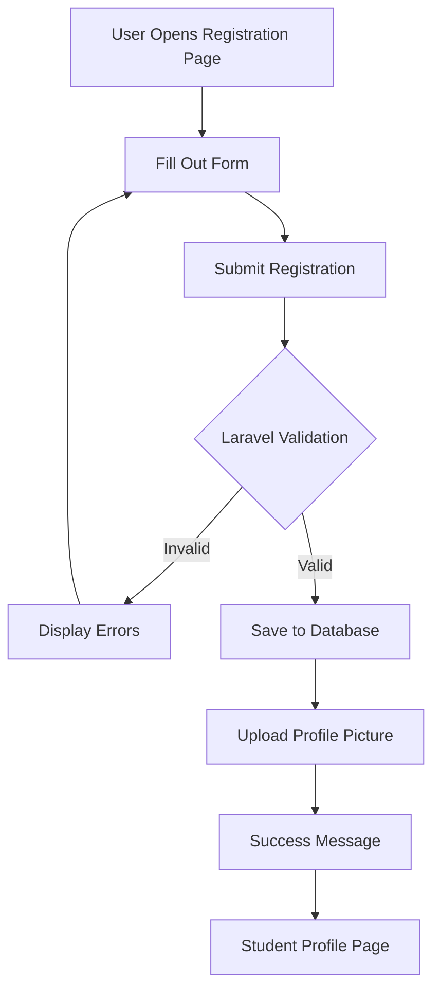

# Student Registration System with Laravel Forms

A complete Laravel web application that replaces paper-based student registration with a digital system. Students can register online, submit personal and academic information, upload a profile picture, and view their registered profile. Built with Laravel, PHP, MySQL, Blade, Laravel Storage, and Tailwind CSS.

**Repository:** `Student-Registration-System-with-Laravel-Forms` (public on GitHub)

---

## Table of Contents

1. [Introduction](#1-introduction)
2. [Objectives](#2-objectives)
3. [Laravel Request Lifecycle](#3-laravel-request-lifecycle)
4. [Validation Rules](#4-validation-rules)
5. [Database Design](#5-database-design)
6. [Flowchart](#6-flowchart)
7. [Screenshots](#7-screenshots)
8. [Problems Encountered](#8-problems-encountered)
9. [Solutions](#9-solutions)
10. [Reflection](#10-reflection)
11. [References](#11-references)
12. [Required Diagrams](#12-required-diagrams)
13. [Git Commit History](#13-git-commit-history)

---

## 1. Introduction

### Purpose of a Student Registration System

A Student Registration System is a fundamental component in educational institutions that streamlines the process of enrolling students into academic programs. Traditional paper-based registration systems are prone to data entry errors, loss of records, and inefficiencies in retrieving student information. A digital registration system addresses these challenges by providing a centralized, accessible, and secure platform for managing student data.

This system allows students to fill out registration forms online, submit their personal and academic information, and upload required documents such as profile pictures. The data is then stored securely in a database, enabling administrators and staff to easily access and manage student records.


## 2. Objectives

By completing this project, the following learning objectives have been accomplished:

1. **Understand the Laravel Framework**: Gain hands-on experience with Laravel's MVC architecture, routing, controllers, models, and Blade templating engine.

2. **Implement Form Handling**: Learn how to create responsive registration forms with proper field grouping, labels, and input types using Tailwind CSS.

3. **Apply Server-Side Validation**: Implement comprehensive validation rules including required fields, unique constraints, email validation, numeric validation, image validation, and file size restrictions.

4. **Master File Upload Handling**: Understand Laravel's file storage system, including secure file uploads, storage links, and path management.

5. **Work with Flash Messages**: Implement success and error notifications that provide immediate feedback to users after form submission.

6. **Design Database Schemas**: Create well-structured database tables with appropriate data types, primary keys, and constraints using Laravel migrations.

7. **Build Responsive Interfaces**: Develop mobile-friendly user interfaces that adapt to different screen sizes using Tailwind CSS.

8. **Apply MVC Architecture**: Separate concerns by organizing code into Models, Views, and Controllers following Laravel best practices.

9. **Version Control with Git**: Practice meaningful commit messages and maintain a clean Git history throughout the development process.

10. **Document Software Projects**: Create comprehensive documentation including setup instructions, validation rules, database design, and project reflection.

---

## 3. Laravel Request Lifecycle

A registration POST flows as:

```
Browser (form @ /students/create)
  → Route (POST /students → StudentController@store, routes/web.php:10)
    → Controller (StudentController::store)
      → Validation (StoreStudentRequest::rules — authorize → rules, app/Http/Requests/StoreStudentRequest.php:14)
        → Model (Student::create($validated), app/Models/Student.php:7, fillable + casts)
          → Database (MySQL week04_student_registration.students, INSERT, database/migrations/2026_08_27_031726_create_students_table.php:14)
            → Response (redirect()->route('students.show', $student)->with('success'))
              → Browser (302 → GET /students/{id}, show.blade.php with asset('storage/...'), flash banner)
```

Diagram: `documentation/laravel-request-lifecycle.png`

```mermaid
graph LR
  B[Browser Form] --> R[Route POST /students]
  R --> C[Controller store]
  C --> V{FormRequest Validation}
  V -->|fails| E[Redirect back + errors]
  V -->|passes| S[Store image public disk]
  S --> M[Model Student::create]
  M --> DB[(MySQL students)]
  DB --> Resp[Redirect 302 → GET /students/{id} + flash]
  Resp --> BV[Browser Profile Page]
```

---

## 4. Validation Rules

All rules live in `app/Http/Requests/StoreStudentRequest.php:14`.

| Field | Rule | Why Important |
|-------|------|---------------|
| student_id | `required\|string\|unique:students,student_id` | Prevents duplicate registrations |
| first_name / last_name | `required\|string\|max:100` | Ensures complete student records |
| middle_name | `nullable\|string\|max:100` | Optional field for flexibility |
| email | `required\|email\|unique:students,email` | Valid communication channel |
| mobile_number | `required\|numeric\|regex:/^09[0-9]{9}$/` | Philippine mobile format (09XX) |
| gender | `required\|in:Male,Female,Other` | Restricts to valid options |
| date_of_birth | `required\|date` | Valid date format |
| program | `required\|string` | Academic program selection |
| year_level | `required\|string` | Year level selection |
| address | `required\|string` | Complete address required |
| profile_picture | `required\|image\|mimes:jpg,jpeg,png\|max:2048` | Valid image, max 2MB |

Server-side validation is authoritative — client-side can be bypassed. Errors are shown via `@error` per field and a summary in `layouts/app.blade.php`.

---

## 5. Database Design

ERD Image: `documentation/Database ER Diagram.jpg`

Mermaid Source (for GitHub rendering):

```mermaid
erDiagram
  STUDENTS {
    bigint id PK "auto_increment"
    varchar student_id UK "unique"
    varchar first_name 100
    varchar middle_name 100 nullable
    varchar last_name 100
    varchar email UK
    varchar mobile_number 20
    varchar gender 20
    date date_of_birth
    varchar program 100
    varchar year_level 20
    text address
    varchar profile_picture 255 "path"
    timestamp created_at
    timestamp updated_at
  }
```

Table Structure (MySQL `week04_student_registration.students`):

| Column | Type | Null | Key | Default |
|--------|------|------|-----|---------|
| id | bigint unsigned | NO | PK, auto_increment | — |
| student_id | varchar(255) | NO | UNI | — |
| first_name | varchar(100) | NO | — | — |
| middle_name | varchar(100) | YES | — | NULL |
| last_name | varchar(100) | NO | — | — |
| email | varchar(255) | NO | UNI | — |
| mobile_number | varchar(20) | NO | — | — |
| gender | varchar(20) | NO | — | — |
| date_of_birth | date | NO | — | — |
| program | varchar(100) | NO | — | — |
| year_level | varchar(20) | NO | — | — |
| address | text | NO | — | — |
| profile_picture | varchar(255) | NO | — | — |
| created_at | timestamp | YES | — | NULL |
| updated_at | timestamp | YES | — | NULL |

Primary Key: `id`
Constraints: `UNIQUE(student_id)`, `UNIQUE(email)`
Migration: `database/migrations/2026_08_27_031726_create_students_table.php:14`
Model: `app/Models/Student.php:7`

---

## 6. Flowchart

Image: `documentation/Registration Flowchart.drawio.png`



---

## 7. Screenshots

All captures saved under `screenshots/`:


---

## 8. Problems Encountered

1. **OneDrive Files On-Demand Reparse Point** — `C:\Users\...\Default Project` is `dar--l`, ReparsePoint `0x9000e01a` → `mkdir(): No such file` and `500 SQLiteDatabaseDoesNotExistException`.

2. **SQLite vs MySQL mismatch** — Spec requires MySQL Workbench, but Laravel default is sqlite with `SESSION_DRIVER=database`.

3. **Validation not appearing / Route ordering** — `GET /students/{student}` before `GET /students/create` would capture create as `{student}`.

---

## 9. Solutions

1. **Reparse Point**: Created project in writable `C:\...\AppData\Local\Temp\opencode\week04-student-registration`, `C:\...\Documents\week04-student-registration`, and `C:\...\paios projects\week04-student-registration`.

2. **MySQL**: Created MySQL DB `week04_student_registration`, switched `.env`: `DB_CONNECTION=mysql`, `SESSION_DRIVER=file`, `CACHE_STORE=file`, `QUEUE_CONNECTION=sync`, `php artisan migrate`.

3. **Validation/Routing**: Set `StoreStudentRequest::authorize:true`, moved `GET /students/create` before `GET /students/{student}`, used `@error` per field.

---

## 10. Reflection

Validation is not just a small UI touch. It is a deal that protects the data. In this project, anything that reaches students goes through `StoreStudentRequest` first. This step stops duplicate `student_id` and duplicate `email` entries from slipping in. If that failed, you could end up with two accounts for one person. Then lookups break, enrollment views get wrong, and receipt printing no longer matches the right records.

There are also length checks, like `max:100`. Those rules help avoid problems in MySQL. They also prevent weird overflow in the Tailwind layout. The email rule helps catch typing mistakes early. That way you do not create addresses that later bounce in notifications. For `mobile_number`, the numeric rule keeps the value in a stable shape. It also makes SMS gateway handling more consistent.

The most important rule is `profile_picture: image|mimes|max:2048`. Without it, a user could upload a non-image file or something huge. That would waste space in `storage/app/public`. In a worst-case scenario, a risky file could be served in an unsafe way if it ever ends up being treated as executable. The `jpg`, `jpeg`, and `png` limits, plus the 2 MB cap, keep storage size predictable. They also help the `asset('storage/...')` preview load quickly.

Working with this input showed a clear point. The browser should be treated as untrusted. You can add client hints like `required` and `accept="image/*"` to make the page feel smoother. The preview flow using `URL.createObjectURL` gives fast feedback. Still, those checks do not count as protection. Server rules are the real enforcement.

Laravel FormRequest puts these rules in one place. It keeps `StudentController@store` short. The method can focus on `$request->validated()`, the `store('profile_pictures','public')` call, and `Student::create`. It also makes tests more predictable. After redirects, `old()` and `@error` help keep each field's context visible. That matters for a long form with around 12 fields. Losing what the user typed can lead to frustration and repeat submits.

Real enterprise apps start with sign-up. It is the first step into the whole system. You see the same flow again and again: a form, a form request, a model, then the database, then a flash step, and finally the user profile.

That pattern shows up in patient intake, in bringing on new customers, and in employee self-service. The students setup you have seen follows the same shape as customers or members will in the E-Commerce work ahead.

In both cases, the table uses a unique business key, keeps contact and school fields, stores a file path, and has timestamp columns. The fillable list is used as an allow-list. The casts rules also stay in place.

If you learn this right now, later parts of the app will be easier. Things like login, role checks, payments, and order work can rely on clean identities. So the goal is not just the CRUD screens. It is also careful request handling, safer file work, and Git habits such as 10 real commits that fit what a junior Laravel developer is expected to do.

---

## 11. References

Laravel. (2025). *Laravel documentation (v13) — Requests, Validation, Eloquent, Migrations, Storage*. https://laravel.com/docs

PHP Group. (2025). *PHP manual — Language reference*. https://www.php.net/docs.php

Oracle. (2025). *MySQL 8.0 reference manual — Data types and CREATE TABLE*. https://dev.mysql.com/doc/refman/8.0/en/

Tailwind Labs. (2025). *Tailwind CSS documentation — Utility-first framework*. https://tailwindcss.com/docs

Mozilla Developer Network. (2025). *MDN Web Docs — HTML forms and File API*. https://developer.mozilla.org/en-US/docs/Web/HTML

---

## 12. Required Diagrams

Save as `documentation/`:

- `documentation/Registration Flowchart.drawio.png` — Registration flowchart
- `documentation/Database ER Diagram.jpg` — Database ER Diagram
- `documentation/laravel-request-lifecycle.png` — Laravel Request Lifecycle Diagram

---

## 13. Git Commit History

```
feat: initial Laravel project setup
feat: create student migration
feat: create Student model
feat: create StudentController
feat: add student routes
feat: build registration form and student views
refactor: use StoreStudentRequest for validation
feat: add image preview and project folders
style: improve ui&ux
docs: add screenshots
```
